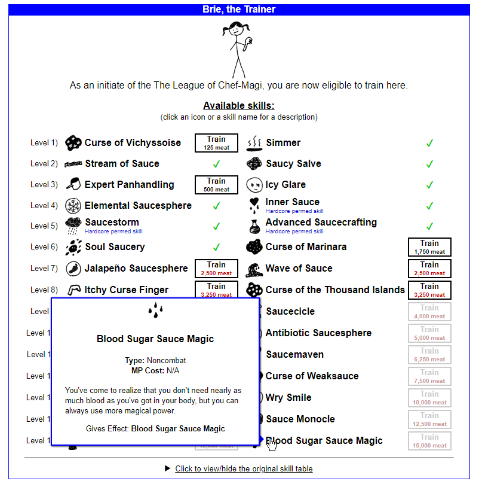

# BetterTrainer

BetterTrainer is a relay override script for KoLmafia.
It provides a better UI for your guild's skill trainer.

## Installation

Enter the following into KoLmafia's gCLI:

```
svn checkout https://github.com/pastelmind/bettertrainer/trunk/release
```

## Features

- Compact 2-column layout
- Show skill description on hover
- Show guild skills you already bought
- Show perm status of each skill
- Highlight skills you can't afford right now

## Screenshots


