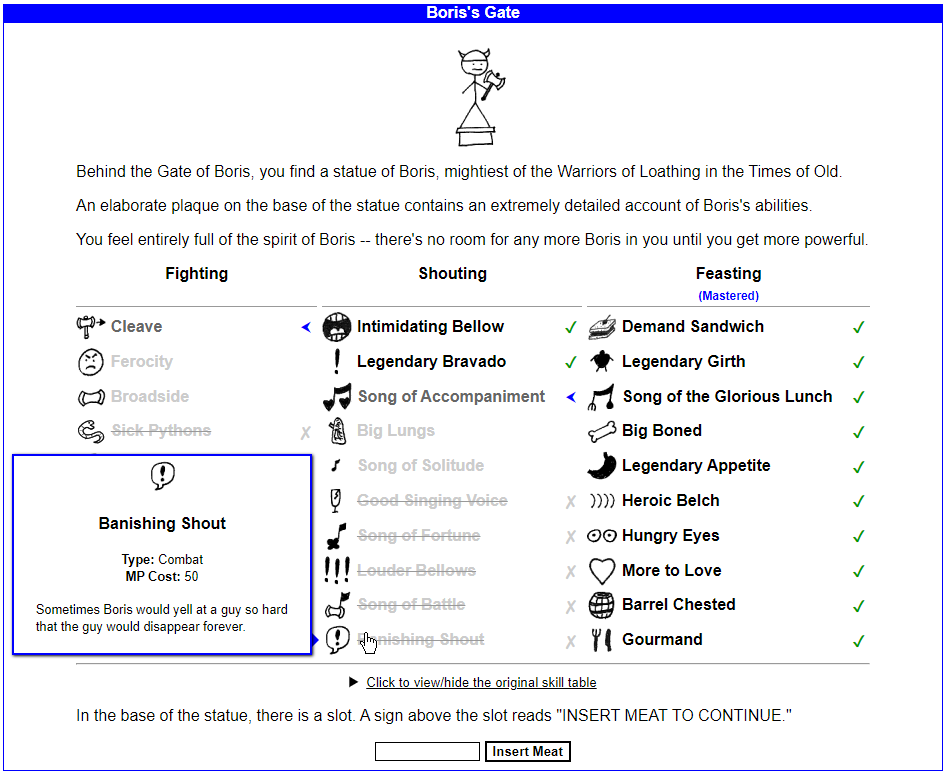

# BetterTrainer

BetterTrainer is a relay override script for KoLmafia.
It provides a better UI for your guild's skill trainer, as well as Boris's Gate in Avatar of Boris.

## Installation

Enter the following into KoLmafia's gCLI:

```
svn checkout https://github.com/pastelmind/BetterTrainer/trunk/release
```

## Features

For guild skills:

- Compact 2-column layout
- Show skill description on hover
- Show guild skills you already bought
- Show perm status of each skill
- Highlight skills you can't afford right now

For Avatar of Boris:

- Show skill description on hover
- Show skills you already unlocked
- Highlight skills you can unlock next, and those you cannot obtain this run

## Screenshots



